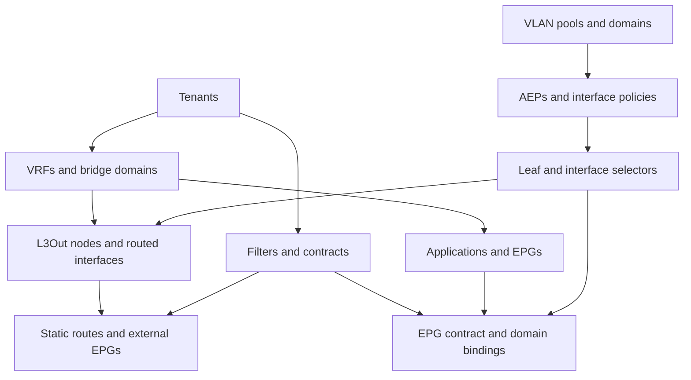

# Configuration model and ownership

`schema_version: 1` identifies the model contract. `target` selects an environment, an APIC DNS
name and an explicit list of allowed APIC firmware versions. Resource sections are lists of
objects. Names and supported settings use the corresponding Cisco module parameter names.

The [JSON Schema](../schemas/aci.schema.json) is authoritative for supported fields, required
values, types and ranges. [The resource registry](../schemas/resources.json) defines object
identities. [Module coverage](MODULES.md) connects each section to official documentation.
Comments are supported. YAML anchors, aliases, duplicate keys, template expressions, unknown
fields, embedded credentials and per-object module overrides are rejected.

## Dependency order

The actual role sequence is tenants, access, network, contracts, L3Out and bindings.
All references must resolve inside the same model. This includes shared access objects: importing
an existing resource means explicitly declaring it and reviewing the changes this repository
would make to it. Reusing objects in `common` or other unmanaged tenants is outside this model.
The built-in `common`, `infra` and `mgmt` tenants cannot be managed as tenant resources.
Shared **access** policies under `uni/infra` are managed through the access role.

## What validation checks

- Required fields, valid enums and resource identities; every managed parent and relationship.
- VRF enforcement, explicit contract directions and preferred-group exclusion.
- VLAN ranges, pool overlap, EPG domain/AEP reachability and access-policy paths.
- IPv4 gateway validity, overlapping BD subnets in one VRF and public-subnet L3Out associations.
- Access selector collisions, duplicate encapsulations on a path and routed/EPG port conflicts.
- Static route prefixes, usable directly connected next hops and matching BD/L3Out VRFs.

Checks describe the supplied model, not the fabric's complete existing state. They do not prove
hardware support, available ports, endpoint reachability, APIC object ownership, route symmetry,
or the absence of conflicts with objects managed outside this repository. Existing overlapping
fabric policies must be discovered and reviewed before adoption.

## Reconciliation behavior

Tasks always use `state: present`. Explicit values are reconciled on every run. Optional omitted
fields are passed as `omit`; collection defaults and APIC defaults can still apply, especially
when objects are first created. Read the pinned module behavior before extending a field.

Removing a list entry, a relationship, or an optional field does not express deletion or reset.
Renaming an object creates a new identity and leaves the previous object behind. Verification
checks declared settings through collection check mode; it does not reject every unmanaged
object or extra child in APIC. It is not a whole-fabric compliance audit.

Changing the VRF of a BD, EPG bindings, contract relations, routing or leaf selectors can affect
live traffic even with `state: present`. In particular, applying a static-only L3Out to an existing
dynamic-routing L3Out may remove protocol children through the collection's reconciliation.
Use dedicated names and review adoption diffs carefully. Do not use sample intent to adopt
an unrelated production fabric.

## Extending the model

Add a section to the schema and registry, create its task in the correct dependency order,
add reference and topology checks in the filter, and include positive and negative tests.
Update the examples and coverage documentation. Validate arguments against the pinned collection,
then run real APIC create/update/check-mode/idempotency tests on the target release.

Large features such as vPC, BGP, IPv6 and VMM need a topology design and operational validation;
simply widening an enum is insufficient. Secret-bearing features need a separate secret source
and report-redaction design. Raw REST POST payloads are not accepted by this repository's model.
